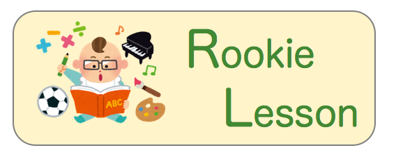

  

  <b><a href="#about">About</a></b>
  |
  <b><a href="#agenda">Agenda</a></b>
  |
  <b><a href="#license">License</a></b>

 

About
---

香川大学富永研究室に所属している学生向けの技術講義を，研究室メンバで作り上げること目指す．

学習範囲は，富永研究室に沿って幅広くまんべんなくを目指す．

Agenda
---

- [Lesson000 : レッスンの作成手順と方法](./lesson000)
- [Lesson001 : Shell入門](./lesson001)
- [Lesson002 : オブジェクト指向入門](./lesson002)
- [Lesson003 : JavaScript入門](./lesson003)

License
---

**Copyright (c) "SLP-KBIT**

Licensed under the [GNU Free Documentation License](./LICENSE.txt)
