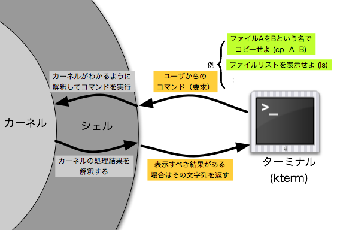

# Shellとは

## kernel

OSの中核となる部分。
アプリケーションとハードウェアレベルでの実際のデータ処理との架け橋となる。
ex. プロセス管理、メモリ管理、デバイス管理、etc...

## Shell

ユーザとkernelの間のやり取りを仲介するプログラム。
ユーザからの入力を、kernelに分かる形(機械語)に変換して伝え、kernelからの応答をユーザにわかる形に変換して表示する。
ユーザから見て、kernelを殻(shell)のように包んでいることからShellと呼ぶ。
CUIの形態をとるコマンドラインシェルとGUIの形態をとるグラフィカルシェルがある。

(引用: http://www.cc.kyoto-su.ac.jp/~hirai/text/shell.html)

## Shellへの命令

コマンドラインシェルにおいて、shellへの命令は**コマンド**を用いて行う。
(コマンドの実体は、実行ファイルである。)

## Shellの種類

### Bourne Shell

UNIXの初期バージョンから使われているデファクトスタンダードなシェル。コマンドはsh。

#### Bourne Shell互換

- Bourne-Again Shell(bash) : shのオープンソース版。LinuxやUNIXでデフォルトのShellとなっていることが多い
- Z Shell(zsh) : 最も機能が豊富なShell。様々なShellの機能を取り入れた上位互換。

### C Shell

BSD向けに開発されたShell。C言語をモデルとした構文規則。スクリプト言語と言うよりは、対話用のコマンドを使うことに特化している。

#### C Shell互換

- TENEX Shell(tcsh) : 富永教員が好んで使うshell。