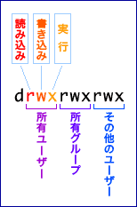

# ディレクトリとは

## ディレクトリ

ディスク上のファイルの置き場。Windowsでいうフォルダ。
複数のファイルを整理しする保管場所。
ディレクトリは、末尾に"**/**" を付けて表示する。例えば、`tmp`ディレクトリは`tmp/`と表示する。
`tmp`ディレクトリの下の`hoge.txt`は、`tmp/hoge.txt`と表示する。

## Linuxにおけるディレクトリ構造

Linuxにおいて、ディレクトリは"**/**(ルート)"ディレクトリを根とした、木構造となっている。
すべてのディレクトリは、ルートディレクトリの下に所属する。
基本的なLinuxのディレクトリ構成は、以下のとおりである。

```
/
├ bin/    一般的なコマンド郡
├ boot/   起動用のファイル郡
├ dev/    デバイスファイル
├ etc/    設定ファイル
├ home/   ユーザのホームディレクトリ
├ lib/    共有ライブラリ
├ mnt/    ファイルシステムの一時的なマウントポイント
├ media/  リムーバル媒体のマウントポイント
├ opt/    実行時に書き換えられないアプリケーションソフトウェアパッケージ
├ proc/   プロセスに関する情報
├ root/   rootユーザ用のホームディレクトリ
├ sbin/   システム管理用コマンド
├ tmp/    一時的なファイルを保管するディレクトリ
├ srv/    システムに提供されたサイト固有のデータ
├ usr/    プログラムやカーネルソース
└ var/    システムログなどの動的に変化するファイル
   └ log/   各種ログファイル
```

## Linuxにおけるディレクトリ・ファイルのパーミッション

Linuxでは、ファイルとディレクトリは全て**「パーミッション」**によって権限が管理されている。パーミッションの種類は、以下の3つがある。  
ディレクトリにおいては、実行権限はディレクトリ内に移動できるということである。

|意味|英語|略表記|
|:---|:---:|:---:|
|読込み|read|r|
|書込み|write|w|
|実行|execute|x|

---
また、ファイル・ディレクトリには所有ユーザと所有グループが必ず設定されている。パーミッションは、これらに対して個別に設定することができる。

|対象|英語|略表記|
|:---|:---:|:---:|
|所有ユーザ|user|u|
|所有グループ|group|g|
|その他のユーザ|others|o|

---
パーミッションの確認は、以下のコマンドを入力することで確認できる。

```
$ ls -l
-rw-r--r-- 1 vitamin member 22757 11月 17 17:47 LICENSE.txt
-rw-r--r-- 1 vitamin member   627 11月 17 17:47 README.md
drwxr-xr-x 3 vitamin member  4096 11月 18 11:12 lesson001/
```

読み方は、以下のとおりである。  
  
(引用: http://begi.net/read/operation/10.html)
  
この場合、LICENSE.txt及びREADME.mdには、どのユーザも読込み権限はあるが、実行権限はない。また、所有ユーザにのみ書込み権限がある。  
また、lesson01/ディレクトリは、どのユーザも詠込むことができ、移動することもできるが、書込み権限は所有ユーザにしかない。
