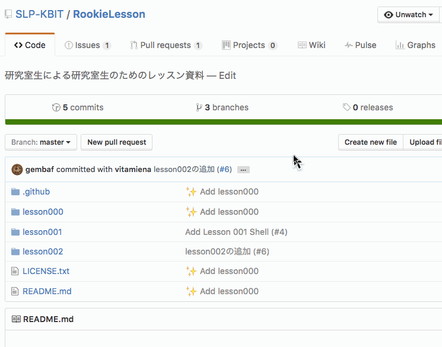
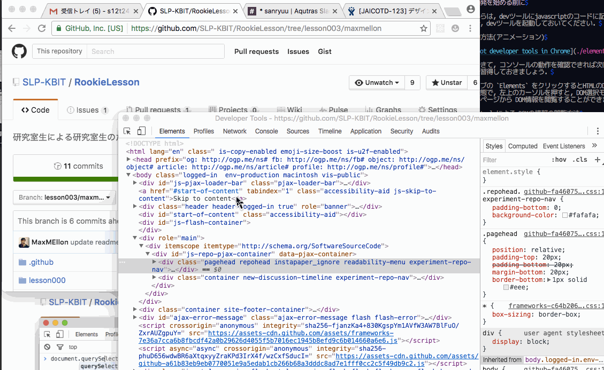

Section02 : DOMを取得してみよう
---

### 開発を始める前に

これからは，devツールにjavascriptのコードに記述して行きます．
なので，devツールを起動しておいてください．

- 起動方法(アニメーション)

  

起動できて，コンソールの動作を確認できれば次は，DOM情報の閲覧方法を
ここで習得しておきましょう．

上のタブの `Elements` をクリックするとHTMLのDOM構造が確認できます．
その状態で，左上のカーソルを押すと，DOM選択モード隣，
実際のページから DOM情報を閲覧することができます．

- dev tool による DOMの情報の閲覧方法

  

### DOMを取得する

- 例題1: github上の左上のアイコンをjavascriptで取得する

  


### 登場したインターフェース, 関数

#### document

```
Document インターフェイスはブラウザに読み込まれた Web ページを表し、
Web ページのコンテンツである DOM ツリーへのエントリポイントとして提供されます。
これはページの URL を取得したりドキュメントで新たな要素を作成するなど、
ドキュメント全体に関わる機能を提供します。
```

  [MDN document](https://developer.mozilla.org/ja/docs/Web/API/document) より

#### :paperclip: document.querySelector(String selector) : `Element`

指定した**セレクタ**`*1`にマッチする先頭のDOMの参照を取得する関数です

```html
<div>
  <p>hoge</p>
  <p>poge</p>
  <p>foo</p>
  <p>bar</p>
</div>
```

```js
document.querySelector('div > p')
//=> <p>hoge</p>
```

##### pick up (似た関数の紹介)

#### :paperclip: document.querySelectorAll(String selector) : `NodeList<Element>`

指定した**セレクタ**`*1`にマッチする先頭のDOMの参照を取得する関数です

```html
<div>
  <p>hoge</p>
  <p>poge</p>
  <p>foo</p>
  <p>bar</p>
</div>
```

```js
document.querySelectorAll('div > p')
//=> [<p>hoge</p>, <p>poge</p>, <p>foo</p>, <p>bar</p>]
```

#### :paperclip: document.getElementById(String id) : `Element`

```html
<div>
  <p id="hoge-string">hoge</p>
</div>
```

```js
document.getElementById('hoge-string')
//=> <p id="hoge-string">hoge</p>
```

特定の id をもつ DOMの参照を取得します

#### :paperclip: document.getElementsByClassName(String className) : `NodeList<Element>`

与えられた class 名を持つエレメント群のリストを返します。

```html
<div>
  <p class="ore-text">hoge</p>
</div>
<div>
  <p class="ore-text">foo</p>
</div>
```

```js
document.getElementsByClassName('ore-text')
//=> [<p class="ore-text">hoge</p>, <p class="ore-text">foo</p>]
```

#### :paperclip: document.getElementsByTagName(String tagName) : `NodeList<Element>`

与えられたタグ名を持つエレメント群のリストを返します。

```html
<div>
  <p class="ore-text">hoge</p>
</div>
<div>
  <p class="ore-text">foo</p>
</div>
<div>
  <p>piyo</p>
</div>
```

```js
document.getElementsByTagName('p')
//=> [<p class="ore-text">hoge</p>, <p class="ore-text">foo</p>, <p>piyo</p>]
```

### `*1` セレクタとは

セレクタというのは，DOMの対象を選択するための表現方法です．

#### セレクタの種類と意味

```js
document.querySelector('p');      // pタグを取得
document.querySelector('p.hoge'); // pタグ かつ クラス名が hoge のものを取得
document.querySelector('div#hoge'); // divタグ かつ idが hoge のものを取得
document.querySelector('div > p.hoge'); // 対象の親タグが div で pタグかつ クラス名がhogeのものを取得
document.querySelector('div#hoge'); // divタグ かつ idが hoge のものを取得
```

- 参考 : [【CSS】CSSのセレクタとは？ 覚えておきたいセレクタ21選](http://scene-live.com/page.php?page=42)
- 参考 : [【CSS】CSS3で追加されたセレクタ　１９選!!](http://scene-live.com/page.php?page=45)

## 演習問題１

[github/SLP-KBIT/RookieLesson](https://github.com/SLP-KBIT/RookieLesson)から，

- タイトルタグを取得せよ
- スター数を持っているDOMを取得せよ
- 左上のアイコン(svgタグ)を取得せよ

---
次のセクション，[section03 : DOMの内容を変更してみよう](./section03.md) へと進む
