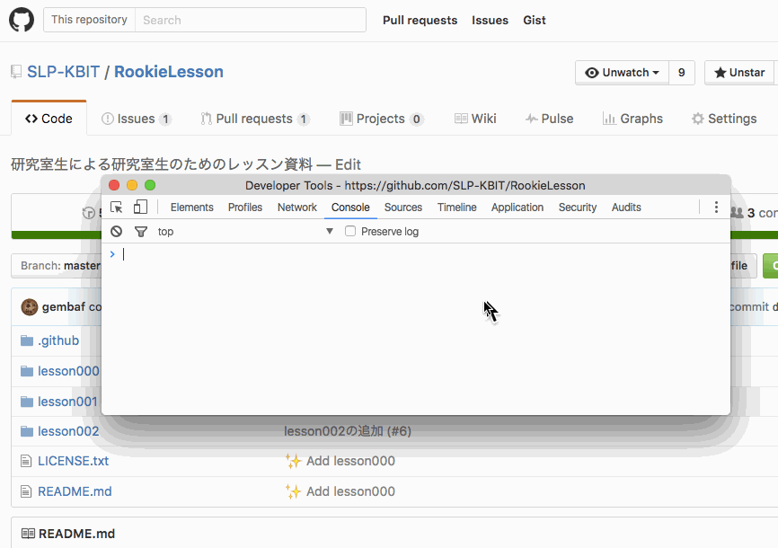

Section04 : DOMのスタイルを変更してみよう
---

### DOMの見た目を変更する

- 例題3: github上の適用なDOMを取得し，色を変更する

  

javascript を使うことによって，**動的**にデザインを変更することができる．
elements.style 以下に css の各設定を格納することができる．
注意としては，css上では `-` (ハイフン) つなぎだったものが，
lowerCamel case で書く必要がある．

##### Example

- `z-index` -> `zIndex`
- `padding-top` -> `paddingTop`

### 演習問題３

[github/SLP-KBIT/RookieLesson](https://github.com/SLP-KBIT/RookieLesson)から，

- 左上のアイコンの色を自分好みのものにせよ
- リポジトリ名のフォントサイズを大きくせよ
- ページ全体の背景色を黒くせよ

---
このレッスンはここで終わりです．
