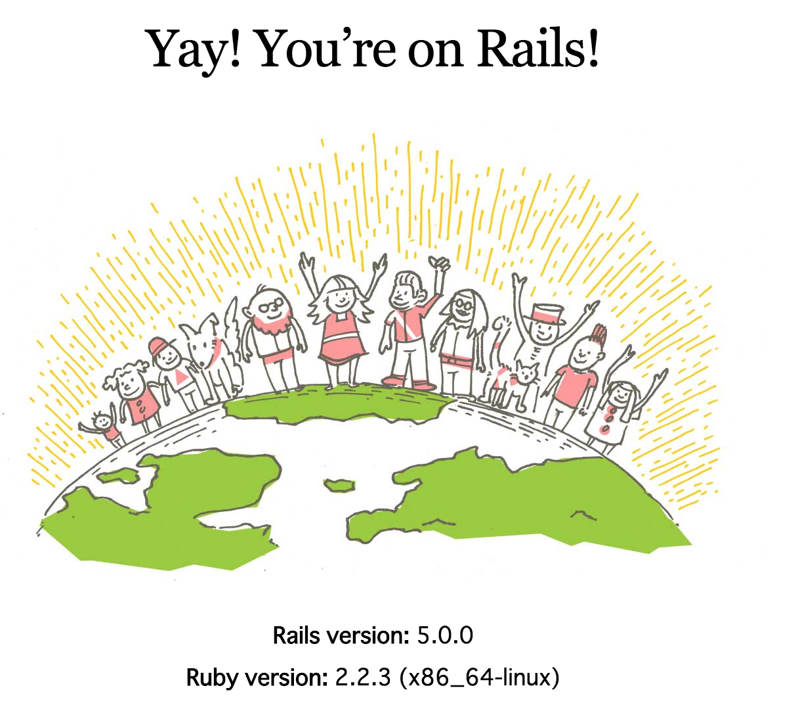

# Railsとプロジェクトを作る

## インストール

```
sudo gem install rails
```

## プロジェクト作成

```
rails new -BT -d postgresql RookeLessonProject
```

- \-Bオプション : bundle installをスキップする (あとで追加するのと、ローカルに入れるため)
- \-Tオプション : Testユニットの作成をスキップする (RSpecを利用するため)
- \-dオプション : 利用するDBを指定 (PostgreSQL、MySQL、MongoDB)

※ bundlerとは : Rubyのパッケージである'gem'の管理ツール

## 関連Gemのインストール

### bundler

Gemfileを参考に、依存gemをinstallするgem

```
bundle install --path vendor/bundle
```

bundleで入れたgemをコンソールから使うためには`bundle exec`をつける必要がある

```
ex. bundle exec rails server
```

## DBの設定

config/database.ymlでDBへの接続設定を記述する。
以下を参考に変更する。
`vitamin`の部分を自身のユーザ名に変更する

```
default: &default
  username: vitamin
  adapter: postgresql
  encoding: unicode
  pool: 5

development:
  <<: *default
  database: RookieLessonProject_development_vitamin

test:
  <<: *default
  database: RookieLessonProject_test_vitamin

production:
  <<: *default
  database: RookieLessonProject_production_vitamin
  password: <%= ENV['ROOKIELESSONPROJECT_DATABASE_PASSWORD'] %>
```

```
# DBの作成
$ bundle exec rake db:create
```

## サーバの起動

```
bundle exec rails s -p PORT -b 0.0.0.0
```



---
次: [Section04](./section04.md): ページを作る
